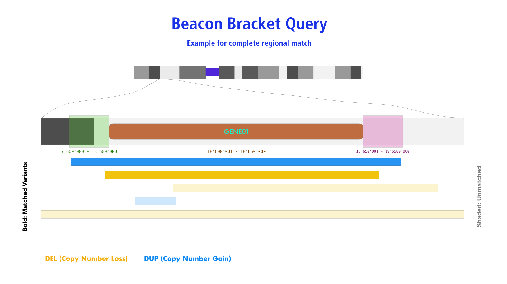

# `VariantBracketRequest` (Beacon v2 default model)

## Description

_Bracket Queries_ allow the specification of sequence ranges for both start and end
positions of a genomic variation. The typical example here is the query for similar
structural variants - particularly CNVs - affecting a genomic region but potentially
differing in their exact base extents.



## Parameters

* `referenceName`
* `start` (min) and `start` (max) - i.e. 2 start parameters
* `end` (min) and `end` (max) - i.e. 2 end parameters
* `variantType` (optional)

!!! Warning "Use of `start` and `end`"

    Bracket queries require the use of **two** `start` and `end` parameters, in contrast
    to _Range Queries_.

!!! Attention "List Parameters in GET Requests"

	Since the direct interpretation of list parameters in queries is not supported by
	some server environments (e.g. PHP, GO…), list parameters such as `start` and `end`
	should be provided as **comma-concatenated** strings when using them in GET requests.


## Examples

### CNV Query - _TP53_ Deletion Query by Coordinates

The following example shows a "bracket query" for focal deletions of the _TP53_ gene locus:

* The start of the deletion has to occurr anywhere from approx. 2.5Mb 5' of the CDR start to just before the end of the CDR.
* The end of the matched CNVs has to be anywhere from the start of the gene locus to approx. 2.5Mb 3' of its end.

This leads to matching of deletion CNVs which have at least some base overlap with the gene locus but are not
larger than approx. 5Mb (operational definitions of focality vary between 1 and 5Mb).

=== "Beacon v2 GET"

	```
	?datasetIds=TEST&referenceName=NC_000017.11&variantType=DEL&start=5000000,7676592&end=7669607,10000000
	```

	#### Optional

	* `datasetIds=__some-dataset-ids__`
	* `filters` ...


=== "Beacon v2 POST"

	```json
	{
	    "$schema":"https://raw.githubusercontent.com/ga4gh-beacon/beacon-v2/main/framework/json/requests/beaconRequestBody.json",
	    "meta": {
	        "apiVersion": "2.0",
	        "requestedSchemas": [
	            {
	                "entityType": "genomicVariation",
	                "schema:": "https://raw.githubusercontent.com/ga4gh-beacon/beacon-v2/main/models/json/beacon-v2-default-model/genomicVariations/defaultSchema.json"
	            }
	        ]
	    },
	    "query": {
	        "requestParameters": {
	        	"g_variant": {
	                "referenceName": "NC_000017.11",
	                "start": [ 5000000, 7676592 ],
	                "end": [ 7669607, 10000000 ],
	                "variantType": "DEL"
		    	}
	        }
	    },
	    "requestedGranularity": "record",
	    "pagination": {
	        "skip": 0,
	        "limit": 5
	    }
	}
	```

	There are optional parameters [`datasetIds`, `filters` ...] and also the option to specify the response type
	(through `requestedGranularity`) and returned data format (`requestedSchemas`). Please follow this up in the
	[framework documentation](framework.md).


=== "Beacon v1"

	```
	?assemblyId=GRCh38&referenceName=17&variantType=DEL&start=5000000,7676592&end=7669607,10000000
	```

	#### Optional

	* `datasetIds=__some-dataset-ids__`


=== "Beacon v0.3"

	CNV query options were only implemented with Beacon v0.4, based on Beacon<sup>+</sup> prototyping.

