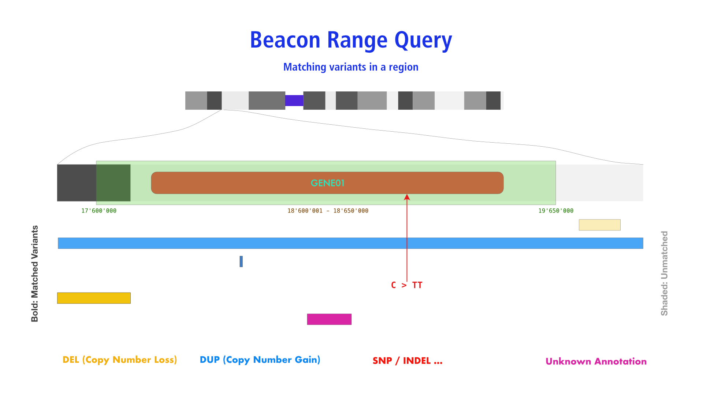

# `VariantRangeRequest` (Beacon v2 default model)

## Description

Beacon _Range Queries_ are supposed to return matches of any variant with at least
partial overlap of the sequence range specified by `reference_name`, `start` and `end`
parameters.



## Parameters

* `referenceName`
* `start` (**single** value)
* `end` (**single** value)
* optional
	- `variantType` **OR** `alternateBases` **OR** `aminoacidChange`
	- `variantMinLength`
	- `variantMaxLength`

!!! Warning "Use of `start` and `end`"

    Range queries require the use of **single** `start` and `end` parameters, in contrast
    to _Bracket Queries_.

## Examples

### Any variant affecting _EIF4A1_ 

=== "Beacon v2 GET"

	_RefseqId `referenceName` (recommended)_
	```
	?referenceName=refseq:NC_000017.11&start=7572837&end=7578641
	```
    
	_Chromosome style `referenceName` (legacy)_
	```
	?assemblyId=GRCh38&referenceName=17&start=7572837&end=7578641
	```

=== "Beacon v2 POST"

	```
	{
	    "$schema":"https://raw.githubusercontent.com/ga4gh-beacon/beacon-v2/main/framework/json/requests/beaconRequestBody.json",
	    "meta": {
	        "apiVersion": "2.0",
	        "requestedSchemas": [
	            {
	                "entityType": "genomicVariation",
	                "schema:": "https://raw.githubusercontent.com/ga4gh-beacon/beacon-v2/main/models/json/beacon-v2-default-model/genomicVariations/defaultSchema.json"
	            }
	        ]
	    },
	    "query": {
	        "requestParameters": {
	            "g_variant":
	                "referenceName": "NC_000017.11",
	                "start": [ 7572837 ],
	                "end": [ 7578641 ]
		    	}
	        }
	    },
	    "requestedGranularity": "record",
	    "pagination": {
	        "skip": 0,
	        "limit": 5
	    }
	}
	```

=== "Beacon v1"

	Range Queries are new to Beacon v2

=== "Beacon v0.3"

	Range Queries are new to Beacon v2

